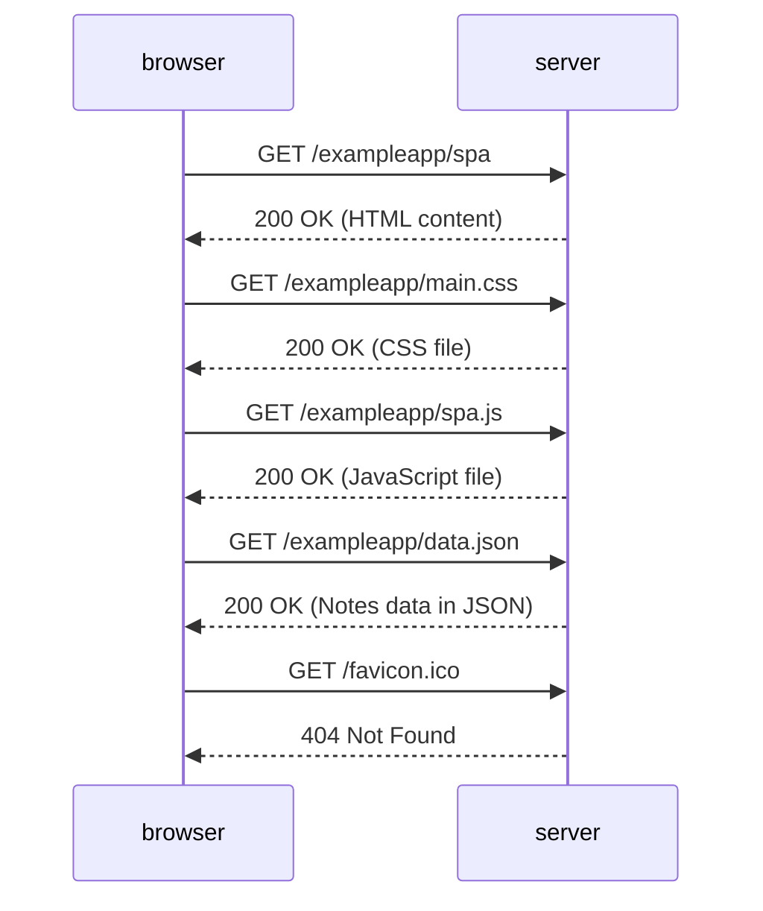

```mermaid
sequenceDiagram
    participant browser
    participant server

    browser->>server: GET /exampleapp/spa
    server-->>browser: 200 OK (HTML content)

    browser->>server: GET /exampleapp/main.css
    server-->>browser: 200 OK (CSS file)

    browser->>server: GET /exampleapp/spa.js
    server-->>browser: 200 OK (JavaScript file)

    browser->>server: GET /exampleapp/data.json
    server-->>browser: 200 OK (Notes data in JSON)

    browser->>server: GET /favicon.ico
    server-->>browser: 404 Not Found

```