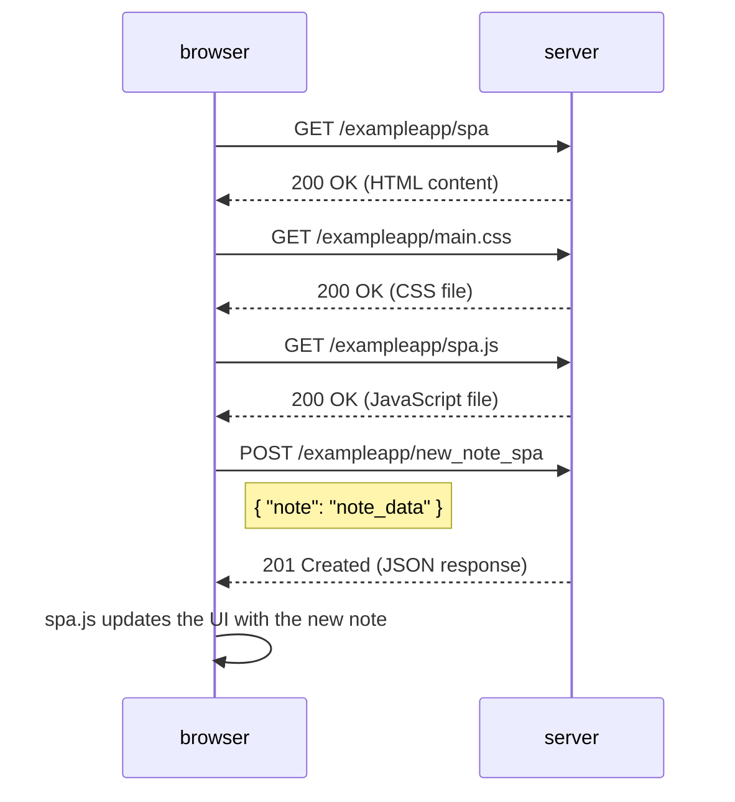

```mermaid
sequenceDiagram
    participant browser
    participant server

    browser->>server: GET /exampleapp/spa
    server-->>browser: 200 OK (HTML content)

    browser->>server: GET /exampleapp/main.css
    server-->>browser: 200 OK (CSS file)

    browser->>server: GET /exampleapp/spa.js
    server-->>browser: 200 OK (JavaScript file)

    browser->>server: POST /exampleapp/new_note_spa
    Note right of browser: { "note": "note_data" }
    server-->>browser: 201 Created (JSON response)

    browser->>browser: spa.js updates the UI with the new note
```